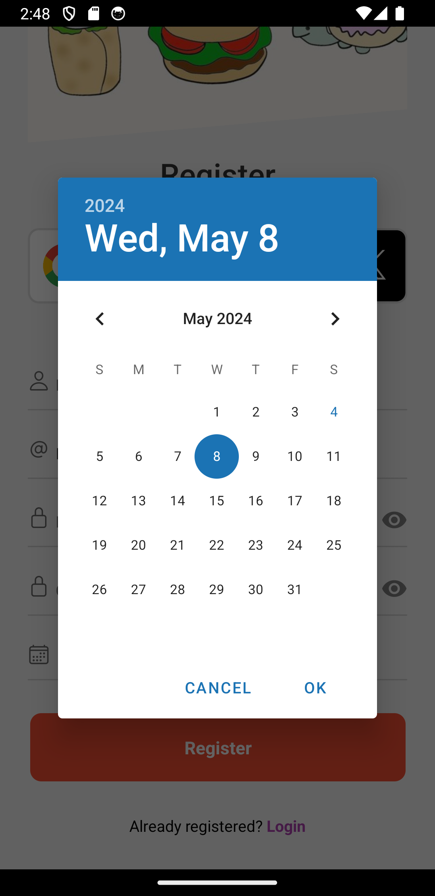

# TEAMMEGERFINISH - CODE FINISH CỦA TEAM
# APP FOODRECIPE

## Minh họa
### FlashScreen  -  Home   -  RecipeDetail
     

### Register   -   Login   -   Login_Success
     

### Profile    -    Adjust Avatar    -    Adjust InfoUser
    

### RecipeDetail_ShowComment    -    RecipeDetail_AddComment     -    SaveScreen (Favourite)
    

### Register_PickDate - InfoDev
 

## Hướng dẫn sử dụng 
>Dành cho các bạn cũng gà như tui (mấy pro vô đọc đừng cười)
- Lụm code về (clone hay down về giải nén đền được)
- Mở Terminel  rồi  cd .\BackEnd\ để vào folder back end
- - npm i  //để cài đặt các thư viện
  - npm star // để chạy sever
- Mở 1 terminal mới
- - npm i //cài thư viện cho front end
  - mở src/screen/localhost tại http://192.168.1.198:3000/api bạn phải sửa lại IP theo đường truyền của bạn (sửa số không sửa chữ nha, mấy số này nè 192.168.1.198, lỡ không biết kiếm ở đâu xu)
  - npx expo start     //chạy front end, hồi nãy không biết kiếm ở đâu thì nó là dãy số bên dưới mã QC code đó
  - a //nếu bạn chạy bằng Android Studio, không lấy điện thoại quét QR cho rồi  
**lỡ nó báo lỗi thì các bạn tắt lỗi đi, chạy tiếp nếu nó chưa đá, app chạy tùy nhân phẩm ^_^**  
**Chúc các bạn vui**

## Link Review DEMO APP FOODRECIPE  https://youtu.be/r5F9rXizOB4  

> Sử dụng React Native, Axio, MongoDB, API free, cloudynary
